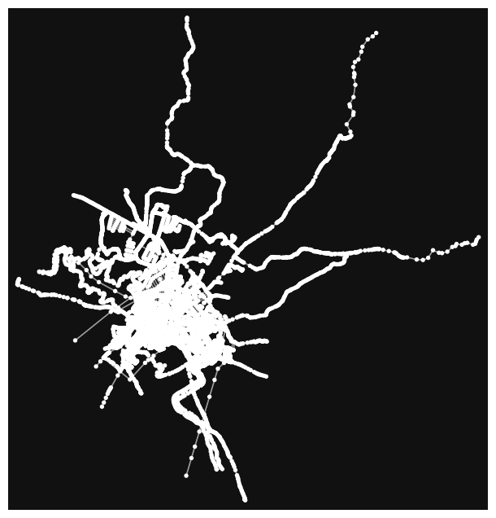
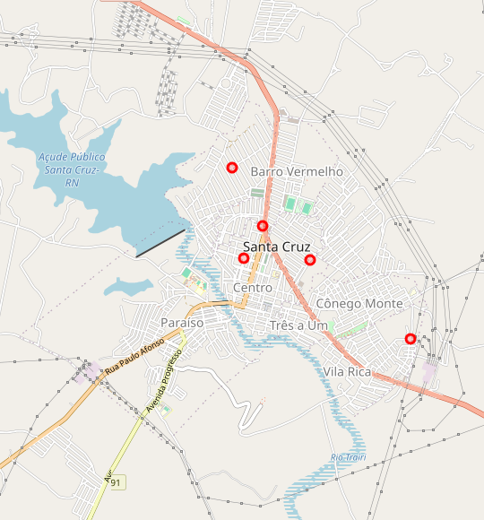
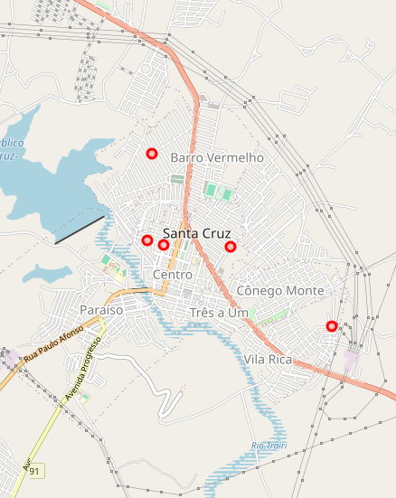
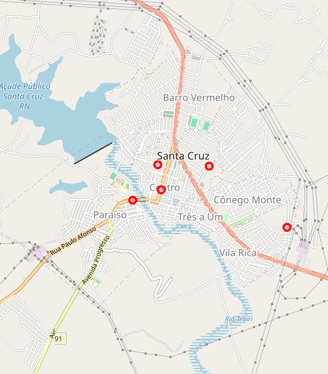

Explicando Essa parte do projeto, geramos o grafo das rodovias da cidade com o matplot.

Como vocês podem ver, é gerado vários nós interligados que mapeiam as rodovias da cidade, formando o mapa que queremos analisar.

Com o grafo em mãos, podemos rodar as métricas utilizando o NetworkX. Vale salientar que diferentes redes foram geradas para o mesmo local, pois, a função de delimitação manual do open street map não é tão precisa, como demonstração, a próxima rede foi gerada com diferença de que ela é mais compacta do que a rede mostrada anteriormente.

No entanto, foram executadas as métricas para todas as redes, avaliando as diferenças que podem ocorrer com as gerações diversas do open street map. O ideal seria pegar a melhor representação da cidade, que seria a parte central da cidade no caso de santa cruz, outras cidades maiores podem ter vários pontos de interesse, o que poderia ser necessário uma delimitação maior no open street map.

Alguns resultados de 3 redes diferentes para a mesma área da cidade de santa cruz, com diferença de pegar uma área delimitada menor em relação a anterior:

Repare que as métricas mudam, o que torna a escolha da área delimitada um ponto cruscial para uma melhor análise do mapa.

A seguir, plotamos num mapa interativo pontos relevantes de cada mapa:

Podemos observar pontos em comum nos 3 mapas, se pegarmos as características delas veremos que:
- O ponto entre os bairros de Vila Rica e Conjunto Cônego Monte é o que possui maior grau.

- O ponto perto da letra 'z' no nome da cidade é o que possui o maior valor de coeficiente de clustering.

- O ponto perto da letra 's' no nome da cidade é o que possui maior valor de auto vetor.

- E os dois pontos que sobram, são os que se alteram de importância quando alteramos o tamanho do mapa/rede. Eles estão relacionados as métricas de betweenness e closeness.

Fazendo uma correlação com as rodovias da cidade e as métricas de rede, podemos concluir que:
- O ponto com maior grau representa o ponto da rodovia que se conecta com mais outros nós, ou seja, se conecta com mais ruas.

- O ponto com maior coeficiente de clustering representa o ponto da cidade que possui mais algomerações de ruas.

- O ponto com maior valor de auto vetor significa que é o ponto de maior interesse em meio a outros ponto de importância relevante e até da rede em geral, essa métrica talvez seja a mais importante, que denota a rua mais importante.

- O ponto com maior valor de betweenness siginifica um ponto que é crucial para conexão da rede, no caso das rodovias, é uma rodovia que faz mais interligação com outras rodovias.

- E o ponto com maior closeness significa que aquele ponto é o que está mais perto de todos os pontos do grafo em relação à qualquer outro ponto do grafo.

Podemos também fazer uma análise de infraestrutura da cidade baseado nessas informações do grafo, como por exemplo, os pontos de maior valor de auto vetor e coeficiente de clustering são relativamente próximos, então é uma área bastante importante da cidade com aglomeração de ruas, que caso não possua sinalização correta e estrutura podem causar problemas de tráfego para a cidade, seria uma área a se investir em sinalização e estrutura de rodovia na cidade.

O ponto de maior grau também necessita de uma estrutura e sinalização para que não ocorra problema de tráfego.

O ponto de maior closeness seria um bom local para um serviço essencial da cidade, já que é ponto mais próximo de tudo, porém, devido sua instável definição quando alteramos o tamanho da rede, um estudo melhor teria de ser desenvolvido para a sua definição.

O ponto de maior betweenness, assim como o de maior closeness, também se torna de menos importância devido sua fácil alteração de acordo com o tamanho do mapa, um ponto que faz maior interligação entre rodovias também necessita de uma atenção.