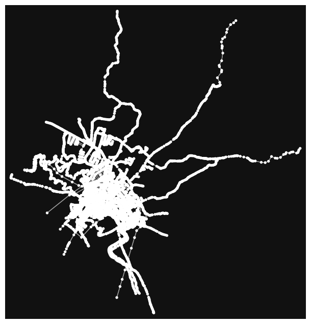
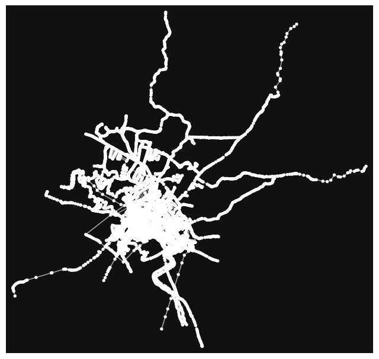
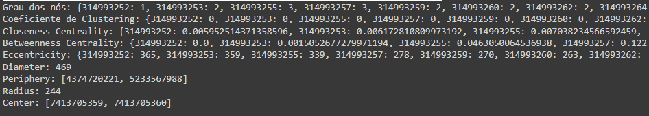
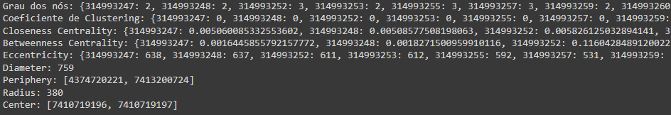
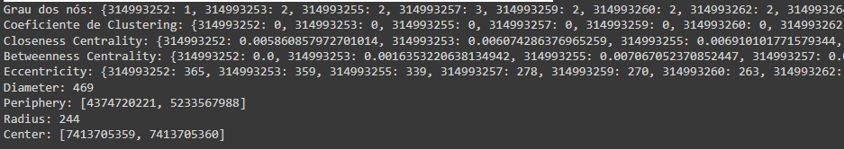
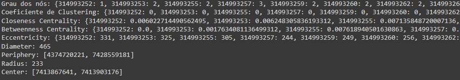
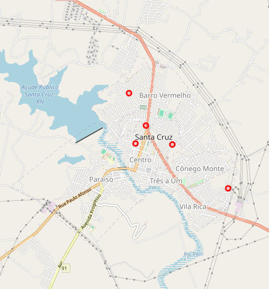
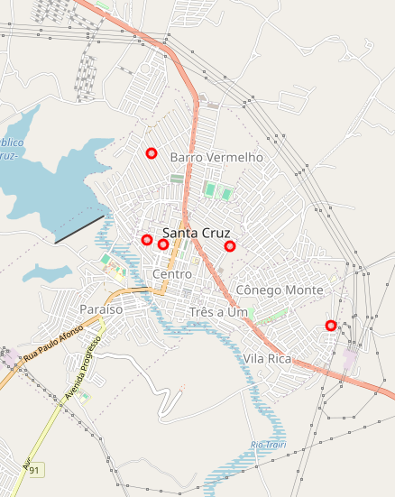
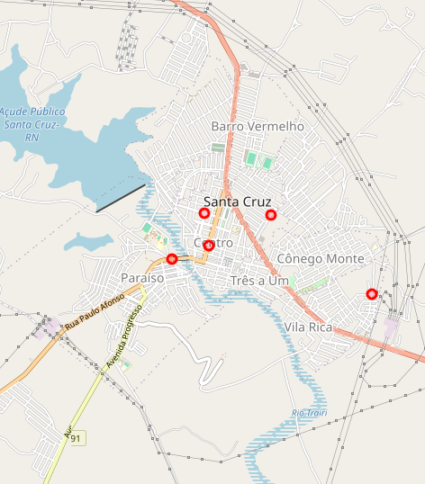

Explicando Essa parte do projeto, geramos o grafo das rodovias da cidade com o matplot.

Como vocês podem ver, é gerado vários nós interligados que mapeiam as rodovias da cidade, formando o mapa que queremos analisar.

Com o grafo em mãos, podemos rodar as métricas utilizando o NetworkX. Vale salientar que diferentes redes foram geradas para o mesmo local, pois, a função de delimitação manual do open street map não é tão precisa, como demonstração, a próxima rede foi gerada com diferença de que ela é mais compacta do que a rede mostrada anteriormente.

No entanto, foram executadas as métricas para todas as redes, avaliando as diferenças que podem ocorrer com as gerações diversas do open street map. O ideal seria pegar a melhor representação da cidade, que seria a parte central da cidade no caso de santa cruz, outras cidades maiores podem ter vários pontos de interesse, o que poderia ser necessário uma delimitação maior no open street map.

Alguns resultados de 3 redes diferentes para a mesma área da cidade de santa cruz, com diferença de pegar uma área delimitada menor em relação a anterior:

Repare que as métricas mudam, o que torna a escolha da área delimitada um ponto cruscial para uma melhor análise do mapa.

A seguir, plotamos num mapa interativoos pontos relevantes de cada mapa:

