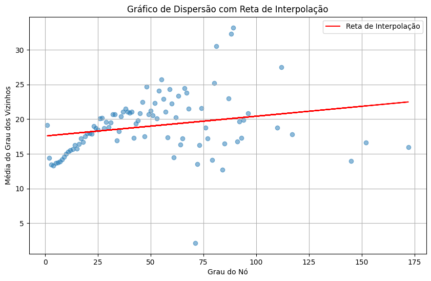
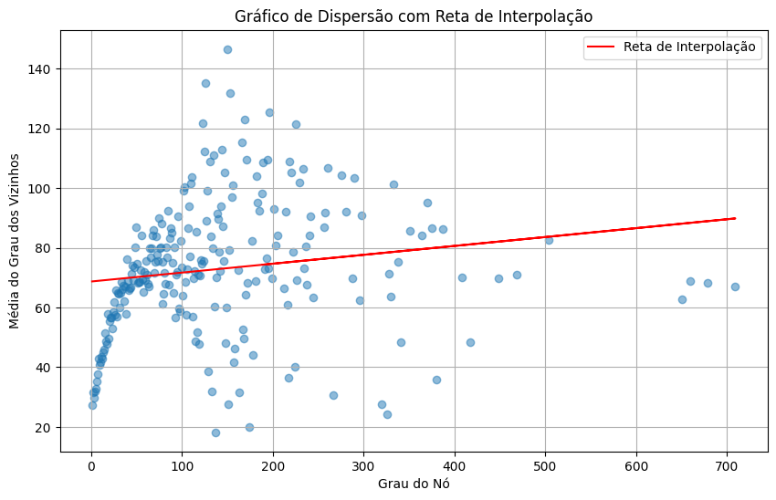
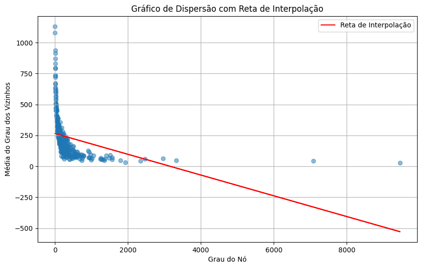
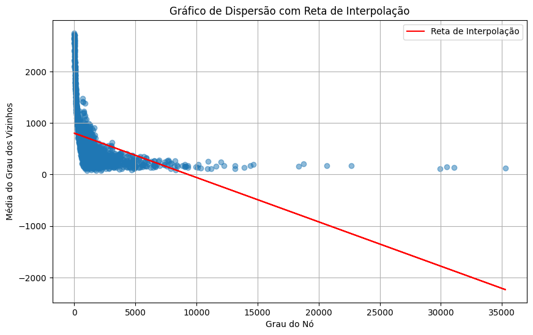
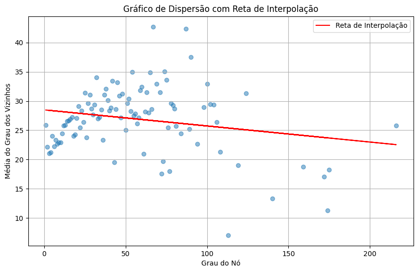

As 5 redes escolhidas foram: Deezer (rede social de usuários da Deezer Europa), Facebook (rede social de páginas verificadas do facebook), Github (rede social de desenvolvedores do github), Last FM Asia (rede social de usuário da Last FM da Ásia) e Twitch (rede social de usuários da Twitch).

Utilizando a comando do NetworkX para cálculo dos graus dos nós e média dos graus dos nós vizinhos (nx.average_degree_connectivity) e plotando os resultados obtivemos os seguintes gráficos:

Deezer   

Facebook   

GitHub   

Twitch   

Last FM   

Com essa relação de grau do nó por média dos graus dos nós vizinhos podemos saber a assortatividade dessas redes.

A interpolação dos pontos do gráfico mostram uma reta, nos gráficos ela é representada pela linha em cor vermelha, ela pode ser tanto crescente como decrescente, como é facilmente notado pelos exemplos acima.

A interpretação dessa análise é que, a reta de interpolação mostram a tendência de assortatividade da rede, os gráficos com retas crescentes mostram que aquelas redes tendem a ser assortativas, ou seja, os nós de um tipo se conectam com seus semelhantes comumentemente, no nosso caso as redes da Deezer e a rede do Facebook. Já onde a reta é decrescente, mostra que a rede tende a não ser assortativa, ou seja, os nós de um tipo não necessariamente se conectam comumentemente com nós do mesmo tipo, como nas redes do GitHub, Twitch e Last FM.